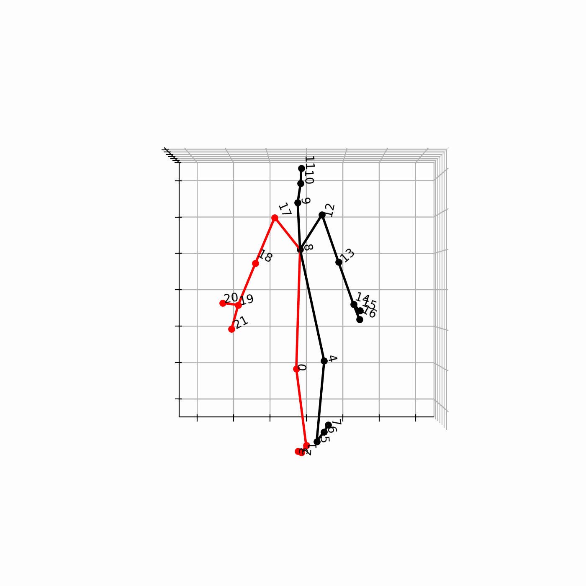

# Human Motion Prediciton Datasets (HMP-Datasets)
## Dataset wrappers for Human Motion Prediction


This package provides easy download scripts for the most common benchmark datasets, PyTorch data loaders and dataset wrappers, as well as scripts for easy and painless download of the raw data.

This repo was built for the purpose of keeping the dataset implementation in separate files and tidying up your experiments repo clean in general.

As a historic fact, I took the liberty to create such a repo, because I found it too cumbersome to sift through all the files and detect how every approach pulled their data. Also, many methods did not provide visualization methods, especially in the scenario of Human 3.6M dataset, where some skeleton joints were omitted. Computing stale numbers is important, but an image tells a thousand words when it comes to evaluating the performance a method.

## What do you get?
_TL;DR_: If your attention span is as short as mine, here's a list of what does this package provide.

- Data loaders and dataset implementations using modern PyTorch paradigms.
- Visualization methods of skeleton joint movement
- Command line scripts to rapidly download the raw data.

## How to install
```bash
pip install -e git+https://github.com/kaseris/hmp-datasets.git
```

### NOTE
Because this repo gets frequently update make sure that you it:

```bash
pip install -U git+https://github.com/kaseris/hmp-datasets.git
```

## How to use it

Here's an example of usage of the package

**Human36M Loader and dataset using my own custom implementation.**
```python
import hmpdata

dataset_train, train_loader = hmpdata.build_dataset(
        path_to_dataset="datasets/dataset_h36m.npz",
        skeleton=hmpdata.Human36MSkeleton,
        fps=50,
        mode="train",
        prefix_len=10,
        batch_size=train_cfg.batch_size,
        augmentations=["downsample"],
    )

# Rest of the training script
...
```

## Download the data
Once you have successfully instald `hmpdata` you can download the raw data using the CLI command

```bash
make36m [quaternet | dlow]
```
You can use either of the two options, and the package will automatically prepare the data for you.

## TODOs

- [x] Human3.6M implementation and visualization

- [ ] HumanEva

- [ ] AMASS (contains HumanEva)

- [ ] Add a requirements file.